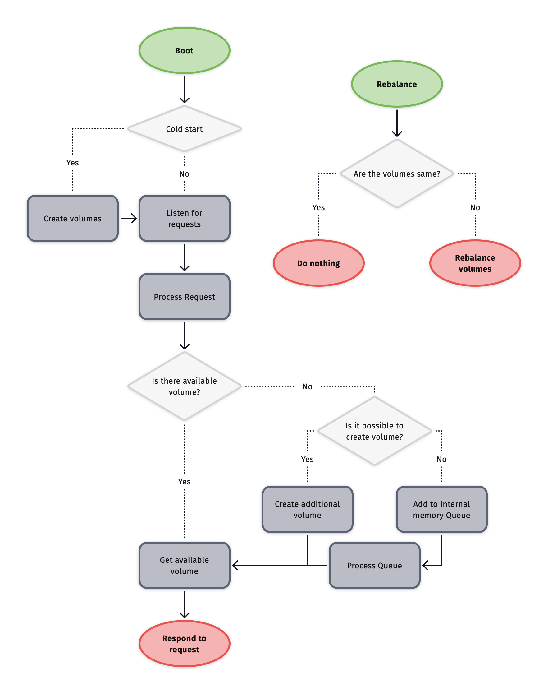

# Grundza
Fast and reliable `key -> value` DB, which balances performance by storing data both in disk and in memory.

Features:
- Cold and Hot data
- Rebalance data for faster access
- Reliable warehouse for all data.

## For what should I use grundza?
- Temporary application cache
- Session cache
- Fast data processing, where grundza will be data middleman

## Diagram sketch

Made with ❤️ by [Matej Buncek](https://github.com/TheMartes)